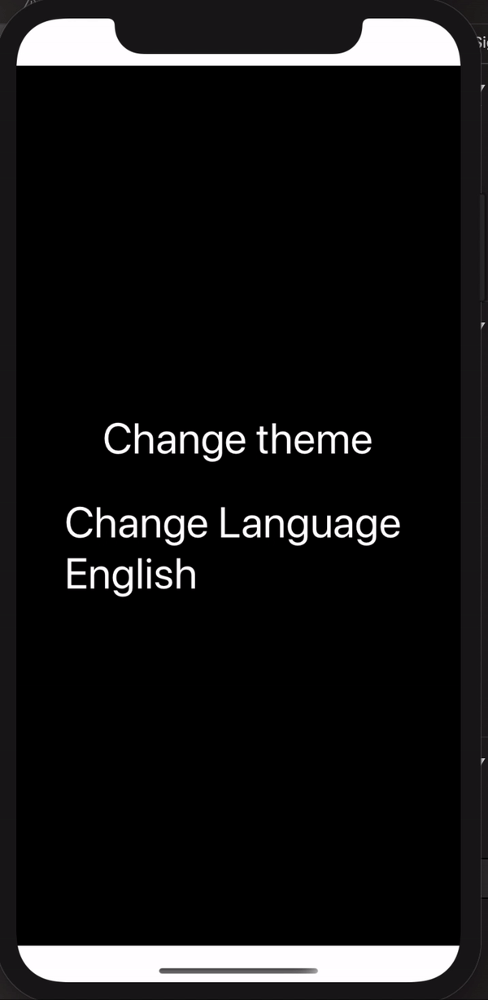

<h1 align="center">
  🚩 Theme-Provider
</h1>

<div align="center">

Wrapper of Context for Theme.

[![Version][version-badge]][package]

</div>

<p align="center" >
  <kbd>
    
  </kbd>
  <br>
  <em>Theme-Provider example app.</em>
</p>

## Usage

**Note: You must be using React Native 0.60.0 or higher to use the most recent version of `react-native-theme-provider`.**

```bash
yarn add react-native-theme-provider
```
OR FROM GIT
```bash
yarn add https://github.com/rabiloo/react-native-theme-provider.git
```

```jsx
- Step 1: Wrapper your App Root 

import {ThemeContainer, DefaultThemeConfig} from 'react-native-theme-provider';

const App = () => (
    <ThemeContainer
      initialThemeCode={DefaultThemeConfig.dark}
      data={{
        dark: {
          background: 'black',
          text: 'white',
        },
        light: {
          background: 'white',
          text: 'black',
        },
      }}>
        <Demo />
    </ThemeContainer>
)

DefaultThemeConfig : dark, light, base_device
```
```jsx
- Step 2: use useThemeColor hook to get Colors data

import {useThemeColor, ThemeService} from 'react-native-theme-provider';

const Demo = () => {
  const {Colors, setThemeCode} = useThemeColor();

  return (
    <SafeAreaView style={{flex: 1}}>
      <View
        style={{
          backgroundColor: Colors.background,
        }}>
        <Text
          style={{color: Colors.text}}
          onPress={() => {
            //get current theme code
            const currentColorScheme = ThemeService.getColorScheme();
            //change to what you want
            setThemeCode({
              themeCode: currentColorScheme === 'light' ? 'dark' : 'light',
            });
          }}>
          Change theme
        </Text>
      </View>
  );
};

```
## Properties

### `data?: object`

Source for App Colors.e.g. 
```js
data= {{ dark: {
          background: 'black',
          text: 'white',
        },
        light: {
          background: 'white',
          text: 'black',
        }}
```    
---

## Supported React Native Versions

This project only aims to support the latest version of React Native.\
This simplifies the development and the testing of the project.

If you require new features or bug fixes for older versions you can fork this project.


## Licenses
MIT